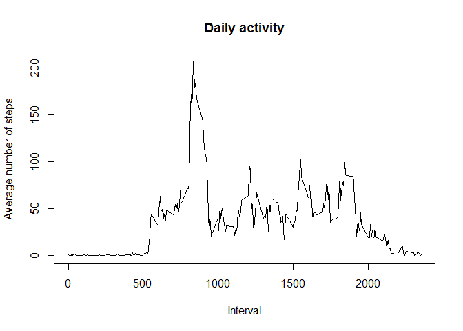
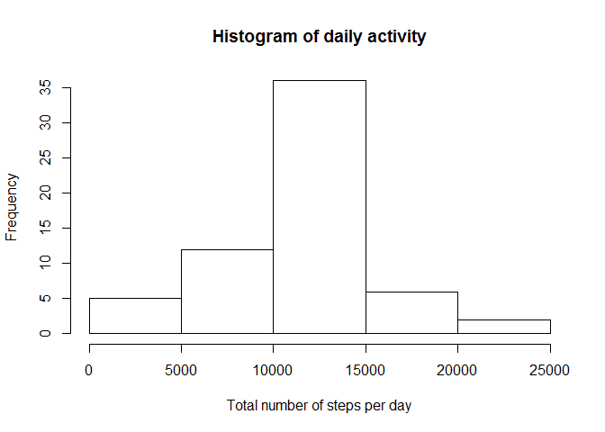
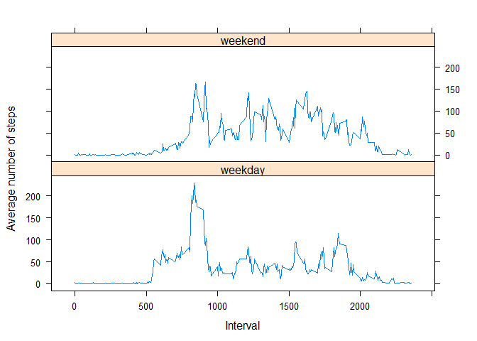

# Reproducible Research: Peer Assessment 1

This report answers some questions using data from a personal activity monitoring device. This device collects data at 5 minute intervals through out the day. The data consists of two months of data from an anonymous individual collected during the months of October and November, 2012 and include the number of steps taken in 5 minute intervals each day.

## Loading and preprocessing the data


```r
library(data.table)
library(dplyr)
library(lattice)

unzip("activity.zip")

activity <- fread("activity.csv")
```

## What is the mean total number of steps taken per day?


```r
dailyActivity <- summarise_each(group_by(activity, date), funs(sum(steps)))

hist(dailyActivity$steps, main = "Histogram of daily activity", xlab = "Total number of steps per day")
```

 

The mean and median total number of steps taken per day:


```r
mean(dailyActivity$steps, na.rm = TRUE)
```

```
## [1] 10766.19
```

```r
median(dailyActivity$steps, na.rm = TRUE)
```

```
## [1] 10765
```

## What is the average daily activity pattern?


```r
avgActivity <- summarise_each(group_by(activity, interval), funs(mean(steps, na.rm = TRUE)))

with(avgActivity, 
     plot(interval, steps, main = "Daily activity", 
          type = "l", xlab = "Interval", ylab = "Average number of steps"))
```

 

On average across all the days in the dataset, the maximum number of steps is at interval:


```r
avgActivity[steps == max(steps), interval]
```

```
## [1] 835
```

## Imputing missing values

The total number of missing values in the dataset is:


```r
sum(is.na(activity$steps))
```

```
## [1] 2304
```

We're using the mean for the 5-minute interval to fill in the missing values. The result is a new dataset that is equal to the original dataset but with the missing data filled in.


```r
avgSteps <- rep_len(avgActivity$steps, nrow(activity))

complActivity <- within(activity, steps <- ifelse(is.na(steps), avgSteps, steps))

dailyActivity <- summarise_each(group_by(complActivity, date), funs(sum(steps)))

hist(dailyActivity$steps, main = "Histogram of daily activity", xlab = "Total number of steps per day")
```

 

The mean and median total number of steps taken per day, after imputation:


```r
mean(dailyActivity$steps)
```

```
## [1] 10766.19
```

```r
median(dailyActivity$steps)
```

```
## [1] 10766.19
```

The imputation has a small impact on the total daily number of steps and the median.

## Are there differences in activity patterns between weekdays and weekends?


```r
# Create a new factor variable with two levels - "weekday" and "weekend"
complActivity$daytype <- factor(ifelse(
     grepl("^S", weekdays(as.Date(complActivity$date))), "weekend", "weekday"))

# Get the 5-minute interval data averaged per type of day
avgStepsPerDaytype <- summarise_each(group_by(complActivity, interval, daytype), funs(mean(steps)))

# Show a panel plot with number of steps per interval, per type of day
with(avgStepsPerDaytype, 
     xyplot(steps ~ interval | daytype, type = "l", 
            xlab = "Interval", ylab = "Average number of steps", layout = c(1,2)))
```

 
